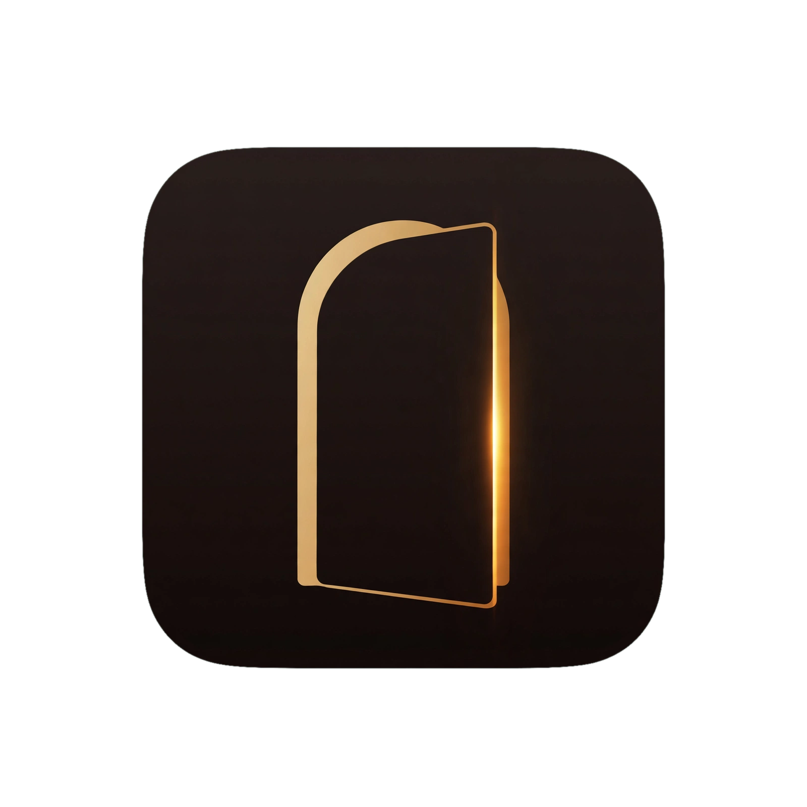

<div align="center">



# The Lounge

**A personal screening room for everything you watch.**

[](https://github.com/rOne-1/the-lounge/releases)
[]()
[](https://flutter.dev)
[](https://dart.dev)
[]()

</div>

---

## Overview

The Lounge consolidates movie and TV discovery, tracking, and personal curation into one app — cleanly divided by content type, never blended together. It's built around three convictions:

- **A "my space" for what you watch, done properly.** Detailed title info, watch-status tracking, and quick discovery belong in one place instead of scattered across a note app, a spreadsheet, and whatever streaming service's own half-built list feature.
- **Nothing you save gets forgotten.** A dedicated swipe deck and Saved shelf exist so a title you spotted somewhere doesn't just vanish into a screenshot folder.
- **Tracking software doesn't have to feel like a spreadsheet.** The Lounge is deliberately tactile and high-polish — a personal screening room, not a utility app.

Recommendation and discovery logic stays transparent by design: genre, cast, and creator similarity against *your own* explicit signals — never a hidden ML black box.

---

## Features

### 🎬 Discover
A signature swipe deck with a fixed four-gesture mapping — skip, save for later, add to watchlist, mark watched — mirrored by tap-target buttons so it's fully usable without gesture input. "Pick For Me" adds a constraint roulette: filter by type, runtime, streaming service, and mood, then let it choose.

### 🛋️ The Lounge
Your personal hub, organized into six independent status shelves — **Watchlist · Saved · Watching · On-Hold · Dropped · Watched** — with a Continue Watching hero that jumps straight to your next unwatched episode.

### 🔎 Search & Detail
Title and cast/director name matching, plus a full Browse & filter mode. Detail pages open with a full-bleed title logo, aggregated cast/crew across every season, regional age ratings, franchise completion tracking, and independent (non-mutually-exclusive) status toggles.

### 📅 Calendar
A read-only release/air-date agenda with explicit, opt-in push sync to Google Calendar — sync only ever happens on an explicit user action, never silently.

### 📊 Analytics
A "Discover Your Habits" hub — a chronological heatmap, binge-velocity view, taste metrics (favorite cast/directors, how your ratings compare to critics), franchise completion, watchlist funnel, and studio affinity. Exportable as a shareable image.

### 🏛️ Halls (multi-profile)
Fully local, on-device profiles — each Hall holds its own partitioned shelves, its own theme, and an optional locked content-language restriction. No accounts, no network sync required.

### 🎨 Themes
A growing roster of hand-designed themes, each with its own display typeface, tactile grain texture, ambient shadow, and signature motion feel — switching themes animates with the app's shared spring physics.

---

## Tech Stack

| | |
|---|---|
| **Framework** | Flutter 3.44.x (Stable) / Dart 3.12 |
| **State management** | Riverpod |
| **Data source** | [TMDB API](https://www.themoviedb.org/documentation/api) — search, discover, cast/crew, ratings, seasons/episodes, trailers, regional watch providers |
| **Calendar sync** | Google Calendar API (push-only, explicit opt-in) |
| **Persistence** | Local-only (`shared_preferences`) — no backend, no accounts |
| **Crash reporting** | Sentry (optional; falls back to local console logging if unconfigured) |
| **Charts** | fl_chart |

Targets **Android, Web, and Windows** with full feature parity, following Material 3 responsive breakpoints across phone, foldable/tablet, and desktop.

---

## Getting Started

### Prerequisites

- [Flutter SDK](https://docs.flutter.dev/get-started/install) 3.44.x (stable channel)
- A [TMDB API Read Access Token](https://www.themoviedb.org/settings/api) (free)

### Setup

```bash
git clone https://github.com/rOne-1/the-lounge.git
cd the-lounge
flutter pub get
```

Copy the example environment file and add your TMDB token:

```bash
cp .env.example .env
```

```env
TMDB_READ_ACCESS_TOKEN=your_tmdb_read_access_token_here
SENTRY_DSN=your_sentry_dsn_here   # optional
```

### Run

```bash
flutter run                # launches on a connected device/emulator
flutter run -d chrome       # Web
flutter run -d windows       # Windows desktop
```

### Test & analyze

```bash
flutter analyze
flutter test
```

This project holds a zero-tolerance policy on `flutter analyze` issues, including info-level lints — a clean run is expected before anything ships.

---

## Project Status

The Lounge is in **active private beta** (`v0.3.4`, Beta 3) with a small group of external testers. Movies & TV are the current scope; a **Books module** (via the Google Books API) is planned as a later phase and is intentionally out of scope for now. Anime is deliberately excluded — it's well served elsewhere, and this app's local-first design wouldn't remove that gap the way it did for movies/TV.

---

## Attribution


This product uses the TMDB API but is not endorsed or certified by TMDB.

---

## License

Private beta — all rights reserved. Not currently licensed for redistribution or public contribution.
