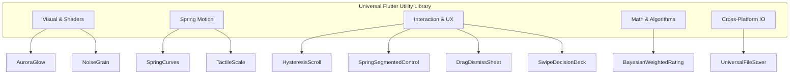

# 📦 Universal Flutter Utility & FX Toolkit — Architecture & Reusability Blueprint

**Target:** 100% Domain-Agnostic Flutter Kit for use across any Flutter project (Fintech, E-Commerce, Social, Health, Productivity, Gaming, etc.).  
**Philosophy:** Zero domain coupling, pure parameter-driven APIs, no global singletons.

---

## 📑 Table of Contents
1. [Core Guarantee: 100% Domain Independence](#1-core-guarantee-100-domain-independence)
2. [Cross-Project Reusability Matrix](#2-cross-project-reusability-matrix)
3. [Universal Modules & Cross-Domain Examples](#3-universal-modules--cross-domain-examples)
   - [1. Multi-Frequency Aurora Ambient Glow](#1-multi-frequency-aurora-ambient-glow)
   - [2. Infinite Procedural Film & Paper Grain Overlay](#2-infinite-procedural-film--paper-grain-overlay)
   - [3. Damped Spring Physics & 2D Simulation Engine](#3-damped-spring-physics--2d-simulation-engine)
   - [4. Tactile Spring Press Micro-Interaction](#4-tactile-spring-press-micro-interaction)
   - [5. Intelligent Scroll Chrome Hysteresis Engine](#5-intelligent-scroll-chrome-hysteresis-engine)
   - [6. Anti-Bias Bayesian Weighted Ranking Algorithm](#6-anti-bias-bayesian-weighted-ranking-algorithm)
   - [7. Velocity-Aware Drag-to-Dismiss Modal Wrapper](#7-velocity-aware-drag-to-dismiss-modal-wrapper)
   - [8. Universal 3-Way Cross-Platform File Exporter](#8-universal-3-way-cross-platform-file-exporter)
   - [9. Type-Safe Spring Segmented Control](#9-type-safe-spring-segmented-control)
   - [10. 4-Way 2D Gesture Swipe Decision Deck](#10-4-way-2d-gesture-swipe-decision-deck)
4. [Standalone Package / Monorepo Architecture](#4-standalone-package--monorepo-architecture)

---

## 1. Core Guarantee: 100% Domain Independence

**None of these utilities are tied to media, movies, or this specific app.** 

Every module has been designed as a pure, mathematical, or visual building block. They accept standard Flutter types (`Color`, `Duration`, `Curve`, `Offset`, `Widget`, generics `<T>`, and primitive numbers) with zero references to any external business logic.

---

## 2. Cross-Project Reusability Matrix

| # | Universal Module | What It Does | Example Use Cases in Unrelated Projects | Dependencies |
| :-: | :--- | :--- | :--- | :--- |
| **1** | **Aurora Glow Shader** | Multi-wave organic background gradient drift | • Fintech: Glowing crypto/card balances<br>• Health: Breathing meditation visualizers<br>• SaaS: Hero banner highlight cards | Pure Flutter |
| **2** | **Procedural Grain Overlay** | GPU-accelerated paper/film noise texture | • Editorial/News: Tactile parchment feel<br>• E-Commerce: Luxury product backdrops<br>• Photo apps: Cinematic grain overlays | Pure Flutter |
| **3** | **2D Spring Engine** | Velocity-preserving 2D physics simulations | • Interactive charts / pull-to-refresh<br>• Draggable floating action bubbles<br>• Custom bottom sheet bounces | `flutter/physics` |
| **4** | **Tactile Scale Button** | Damped micro-compression touch feedback | • Any button, card, list item, or icon<br>• E-commerce "Add to Cart" press feedback | Pure Flutter |
| **5** | **Scroll Chrome Tracker** | Hysteresis auto-hiding top/bottom bars | • Social feeds (Instagram/Twitter style)<br>• News reading apps<br>• Long product catalogs | Pure Dart |
| **6** | **Bayesian Weighted Rank** | Mathematically fair ranking algorithm | • E-commerce product reviews / bestseller sort<br>• Restaurant / food delivery ratings<br>• App marketplace search relevance | Pure Dart |
| **7** | **Drag-to-Dismiss Sheet** | Velocity-aware bottom sheet dismissal | • Image galleries & detail views<br>• Checkout / payment confirmation sheets<br>• Filter & settings modals | Pure Flutter |
| **8** | **Universal File Exporter** | Web + Desktop + Mobile file save bridge | • CSV/PDF report generators<br>• Backup/restore features across all platforms<br>• Receipt & image downloading | Conditional Imports |
| **9** | **Spring Segmented Pill** | Generic type `<T>` animated tab slider | • Billing cycle toggle (Monthly vs Annual)<br>• Theme selector (Light / Dark / Auto)<br>• Filter switchers | Pure Flutter |
| **10** | **2D Swipe Deck Engine** | 4-way gesture commitment card stack | • Flashcard / language learning apps<br>• Dating / social matching apps<br>• Task triaging (Archive, Snooze, Done) | Pure Flutter |

---

## 3. Universal Modules & Cross-Domain Examples



---

### 1. Multi-Frequency Aurora Ambient Glow
* **What it is:** Pure `CustomPainter` rendering smooth, multi-frequency trigonometric wave harmonic equations ($2\pi$ phase interference).
* **Unrelated Project Example (Fintech Card Balance):**
```dart
AuroraGlow(
  color1: const Color(0xFF6366F1), // Indigo
  color2: const Color(0xFFEC4899), // Pink
  duration: const Duration(seconds: 12),
  borderRadius: BorderRadius.circular(24),
  padding: const EdgeInsets.all(20),
  child: Column(
    children: [
      Text('Total Balance', style: TextStyle(color: Colors.white70)),
      Text('\$142,850.00', style: TextStyle(color: Colors.white, fontSize: 32, fontWeight: FontWeight.bold)),
    ],
  ),
)
```

---

### 2. Infinite Procedural Film & Paper Grain Overlay
* **What it is:** Generates a noise tile in GPU memory and applies it using `BlendMode.overlay` with `ImageShader.repeated`.
* **Unrelated Project Example (Luxury E-Commerce / Reading App):**
```dart
// Drop it once at the root Stack of ANY app for a high-end textured look:
Stack(
  children: [
    YourEntireAppRoot(),
    const Positioned.fill(
      child: IgnorePointer(
        child: NoiseGrainOverlay(opacity: 0.035),
      ),
    ),
  ],
)
```

---

### 3. Damped Spring Physics & 2D Simulation Engine
* **What it is:** Standard physics spring normalized into `Curve` and `OffsetSpringSimulation` for multi-axis velocity retention.
* **Unrelated Project Example (Draggable Chat Bubble / Floating Widget):**
```dart
// Preserves finger fling velocity when user releases a floating widget:
final simulation = OffsetSpringSimulation(
  startX: dragPosition.dx,
  endX: targetDockPosition.dx,
  velocityX: flingVelocity.dx,
  startY: dragPosition.dy,
  endY: targetDockPosition.dy,
  velocityY: flingVelocity.dy,
);
controller.animateWith(simulation);
```

---

### 4. Tactile Spring Press Micro-Interaction
* **What it is:** Universal gesture wrapper scaling down content to 96% on touch down with natural damping.
* **Unrelated Project Example (E-Commerce "Add to Cart" Button):**
```dart
TactilePressScale(
  onTap: () => addToCart(productId),
  scaleAmount: 0.94,
  child: Container(
    padding: const EdgeInsets.symmetric(horizontal: 24, vertical: 14),
    decoration: BoxDecoration(color: Colors.black, borderRadius: BorderRadius.circular(12)),
    child: const Text('Add to Cart', style: TextStyle(color: Colors.white)),
  ),
)
```

---

### 5. Intelligent Scroll Chrome Hysteresis Engine
* **What it is:** Pure Dart scroll listener that hides/reveals headers based on directional thresholds while filtering out nested horizontal carousels.
* **Unrelated Project Example (Social Feed / News App):**
```dart
final tracker = ScrollChromeTracker(collapseThreshold: 20.0);

NotificationListener<ScrollNotification>(
  onNotification: (notification) {
    final showHeader = tracker.handle(notification);
    if (showHeader != null) {
      setState(() => _headerVisible = showHeader);
    }
    return false;
  },
  child: ListView.builder(...),
)
```

---

### 6. Anti-Bias Bayesian Weighted Ranking Algorithm
* **What it is:** Mathematical function that weights items by review volume so a 5.0 star rating with 1 review doesn't outrank a 4.8 star item with 2,000 reviews.
* **Unrelated Project Example (E-Commerce / Restaurant App):**
```dart
// Sort product catalog by true Bayesian popularity score:
final fairScore = bayesianWeightedRating(
  itemAverage: product.rating,      // e.g. 4.9
  itemVoteCount: product.reviewCount,// e.g. 42
  minVotesThreshold: 25.0,           // minimum reviews for credibility
  poolMeanAverage: categoryAverage,  // e.g. 4.1
);
```

---

### 7. Velocity-Aware Drag-to-Dismiss Modal Wrapper
* **What it is:** Gesture controller that tracks downward drag distance + fling speed to smoothly dismiss bottom sheets or snap back with spring physics.
* **Unrelated Project Example (Checkout / Profile Modal in Any App):**
```dart
showModalBottomSheet(
  context: context,
  backgroundColor: Colors.transparent,
  builder: (context) => DragToDismissSheet(
    onDismiss: () => Navigator.pop(context),
    child: PaymentConfirmationModal(),
  ),
);
```

---

### 8. Universal 3-Way Cross-Platform File Exporter
* **What it is:** Universal file export handling Web (Blob URL download trigger), Desktop (Native File Picker save dialog), and Mobile (Share Sheet) without platform-specific code in your views.
* **Unrelated Project Example (CSV / PDF / JSON Export):**
```dart
// Works automatically on Web, Windows, macOS, Android, and iOS:
await UniversalFileSaver.save(
  content: invoiceCsvString,
  suggestedFileName: 'invoice_2026.csv',
  mimeType: 'text/csv',
);
```

---

### 9. Type-Safe Spring Segmented Control
* **What it is:** Generic `<T>` pill toggle with spring slide alignment and animated text styling.
* **Unrelated Project Example (SaaS Pricing Plan Toggle):**
```dart
enum BillingCycle { monthly, annual }

SpringSegmentedControl<BillingCycle>(
  items: BillingCycle.values,
  selectedItem: selectedCycle,
  labelBuilder: (cycle) => cycle == BillingCycle.annual ? 'Annual (Save 20%)' : 'Monthly',
  onSelected: (cycle) => setState(() => selectedCycle = cycle),
)
```

---

### 10. 4-Way 2D Gesture Swipe Decision Deck
* **What it is:** 4-way gesture card stack (Swipe Left, Right, Up, Down) with threshold hints, 2D release physics, depth scale interpolation, and undo stack.
* **Unrelated Project Example (Task Triaging / Flashcards):**
```dart
// Left = Archive, Right = Complete, Up = Priority, Down = Snooze
SwipeDecisionDeck<TaskItem>(
  items: taskList,
  onSwipe: (task, direction) {
    if (direction == SwipeDirection.right) markCompleted(task);
    if (direction == SwipeDirection.left) archiveTask(task);
  },
  cardBuilder: (context, task) => TaskSummaryCard(task: task),
)
```

---

## 4. Standalone Package Architecture

When publishing or setting up your private/shared repository:

```
flutter_refined_kit/ (or your chosen package name)
├── lib/
│   ├── flutter_refined_kit.dart          # Master barrel export
│   │
│   ├── shaders/
│   │   ├── aurora_glow.dart              # Multi-frequency wave shader
│   │   └── noise_grain_overlay.dart      # Procedural noise tile overlay
│   │
│   ├── physics/
│   │   ├── spring_curves.dart            # House spring curve & descriptions
│   │   ├── offset_spring_simulation.dart # 2D physics simulation
│   │   └── tactile_press_scale.dart      # Micro-interaction press wrapper
│   │
│   ├── ui/
│   │   ├── spring_segmented_control.dart # Generic type-safe pill toggle
│   │   ├── drag_to_dismiss_sheet.dart    # Velocity-aware bottom sheet wrapper
│   │   └── swipe_decision_deck.dart      # 4-way gesture card stack
│   │
│   ├── algorithms/
│   │   ├── scroll_chrome_tracker.dart    # Hysteresis scroll visibility tracker
│   │   └── bayesian_weighted_rating.dart # Anti-skew ranking formula
│   │
│   └── io/
│       ├── universal_file_saver.dart     # Web/Native cross-platform exporter
│       ├── _saver_web.dart
│       └── _saver_native.dart
│
└── pubspec.yaml
```

Every single component above is completely standalone and ready to be imported into any existing or future Flutter codebase.
